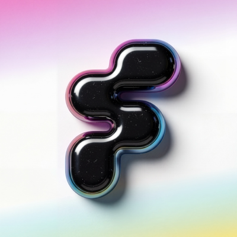

<p align="center">
  
</p>

# web3flutterhq

The ecosystem hub for Flutter × Web3 development on Solana and beyond.

## What This Is

- **Website** — A professionally designed landing page for Flutter × Web3 development
- **Skills System** — An index `skills.md` that AI agents copy into their project, with deep-dive skill files served via API
- **Documentation** — Deep-dive guides that explain not just HOW but WHY things work (and break)

## Project Structure

```
web3flutter/
├── public/
│   └── skills.md              # Index skill file — copyable from the website
├── docs/
│   ├── WRITING_STYLE.md       # Documentation writing style guide
│   ├── SKILL_AUTHORING_GUIDE.md # Guide for AI models writing skill files
│   ├── skills/                # Bot-facing skill files (served via /api/skills/)
│   │   ├── borsh.md
│   │   ├── coral-xyz.md
│   │   ├── solana-core.md
│   │   ├── spl-token.md
│   │   ├── transaction-building.md
│   │   └── ...                # + more per-package skills
│   └── guides/                # Human-facing docs (served on /docs page)
│       ├── solana-package.md
│       ├── borsh.md
│       ├── coral-xyz/         # Multi-section guide
│       │   ├── index.md
│       │   ├── idl-basics.md
│       │   ├── serialization.md
│       │   ├── account-resolution.md
│       │   └── events-and-interface.md
│       ├── solana-mobile.md
│       ├── token-ops.md
│       ├── nft-dev.md
│       ├── defi-patterns.md
│       └── wallet-ux.md
├── src/
│   ├── app/
│   │   ├── layout.tsx         # Root layout
│   │   ├── page.tsx           # Landing page
│   │   ├── globals.css        # Design system tokens
│   │   ├── api/skills/        # Raw markdown API for agent fetching
│   │   └── docs/              # Technical docs reader page
│   └── components/
│       ├── Navbar.tsx          # Fixed navigation
│       ├── Hero.tsx            # Hero with copy CTA
│       ├── MarqueeSection.tsx  # Ecosystem app showcase
│       ├── SkillsHero.tsx     # Skills file preview + copy
│       ├── DocsSection.tsx    # Documentation cards
│       └── Footer.tsx         # Footer with links
└── package.json
```

## Tech Stack

| Layer | Technology |
|-------|-----------|
| Framework | Next.js 16 (App Router) |
| Styling | Tailwind CSS v4 |
| Animations | Framer Motion |
| Fonts | Space Grotesk + JetBrains Mono |
| Icons | Lucide React |
| Docs Format | Markdown (MDX-ready) |

## Development

```bash
npm install
npm run dev     # http://localhost:3000
npm run build   # Production build
```

## Design Philosophy

Inspired by:

- **[anubi.io](https://anubi.io)** — Elegant layout, spaced typography, smooth scroll, project showcases
- **[joinflowparty.com](https://www.joinflowparty.com)** — Bold community energy, marquee text, vibrant 3D elements

Applied with:

- Solana color palette (purple `#9945FF` / green `#14F195`) on deep dark backgrounds
- Grid background patterns with floating gradient orbs
- Parallax scroll effects and intersection-triggered animations
- Typography: Space Grotesk for headings, JetBrains Mono for code

## Assets Needed

- [ ] Rive animation files for interactive elements (fluffy Dash mascot, loading states)
- [ ] OG image for social media sharing (1200x630)
- [ ] Favicon set (16, 32, 180, 192, 512)

## Contributing Docs

All documentation must follow [docs/WRITING_STYLE.md](docs/WRITING_STYLE.md). Key rules:

- Every code example must compile
- Explain WHY, not just HOW
- Include common mistakes table
- Use consistent callout types (CRITICAL, GOTCHA, WHY THIS MATTERS)

## Links

- X: [@web3flutterhq](https://x.com/web3flutterhq)
- Skills file: [public/skills.md](public/skills.md)
